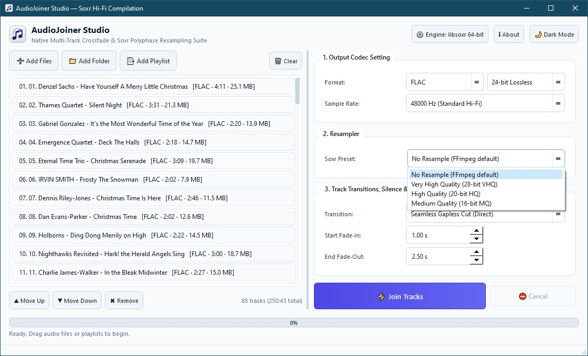
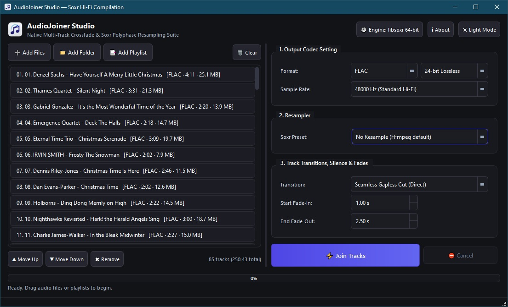

<p align="center">
  
</p>

# AudioJoiner Studio — Native PyQt6 & FFmpeg Soxr Desktop Suite

A lightweight, modern cross-platform GUI program (Windows, Linux, macOS) to join multiple audio files into a single continuous music compilation track with studio-grade fidelity.

> **Screenshots:** 
<p align="center">
   
</p>

## Key Features
- **Native PyQt6 Desktop GUI**: Ultra-responsive native desktop experience with dark and light mode stylesheets.
- **FFmpeg & libsoxr Resampler**: Utilizes SoX 64-bit polyphase resampler with 28-bit VHQ precision presets, selectable from the Resampler preset list (or "No Resample" to use FFmpeg defaults).
- **Drag-and-Drop File Management**: Drop audio files or playlists directly into the queue; drag rows to reorder tracks.
- **Multi-Source Ingestion**: Add individual audio files, entire directories (recursive scan), or audio playlists (`.m3u`, `.m3u8`, `.pls`).
- **Studio Transitions & Crossfades**:
  - Configurable crossfade duration (0.2s - 30.0s) with 7 curve geometries (`tri`, `qsin`, `esin`, `hsin`, `log`, `par`).
  - Custom silence gaps between tracks.
  - Custom Fade-In for track 1 and Fade-Out for the compilation finale.
  - Seamless gapless direct concatenation.
- **Output Formats**: FLAC (24-bit/16-bit), WAV (24-bit/32-bit float), MP3, AAC, OGG Vorbis, OPUS, ALAC. Lossy formats use your selected bitrate. The output location is chosen in a native Save As window when you click Join Tracks.
- **Background Worker**: Multi-threaded compilation (`QThread`) prevents GUI lockups and reports real-time progress via FFmpeg progress pipes.

---

## Quick Start (Running from Python)

### 1. Requirements
- Python 3.9+
- FFmpeg compiled with `libsoxr` (available by default on modern FFmpeg builds)
  - **Windows**: `winget install Gyan.FFmpeg` or download from [gyan.dev](https://www.gyan.dev/ffmpeg/builds/)
  - **macOS**: `brew install ffmpeg`
  - **Ubuntu/Debian**: `sudo apt install ffmpeg libsoxr0`
  - **Arch Linux**: `sudo pacman -S ffmpeg`

### 2. Install Python Dependencies
```bash
# Optional: create a virtual environment
python -m venv venv

# Activate virtual environment:
# Windows:
venv\Scripts\activate
# Linux/macOS:
source venv/bin/activate

# Install PyQt6
pip install -r requirements.txt
```

### 3. Launch Application
```bash
python main.py
```

---

## Packaging into Standalone Executable (.exe, .app, Linux binary)

To build a standalone executable that runs without Python installed:

```bash
python build_executable.py
```

The output binary will be placed inside `dist/AudioJoinerStudio/`.
You can also place `ffmpeg` and `ffprobe` binaries in a `bin/` subfolder next to `main.py` before building to bundle them directly inside your application distribution.

## License

AudioJoiner Studio is free software licensed under the [GNU General Public License v3.0](https://www.gnu.org/licenses/gpl-3.0.html). See the `LICENSE` file for the full text.
